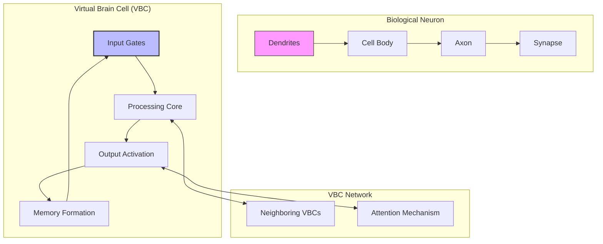
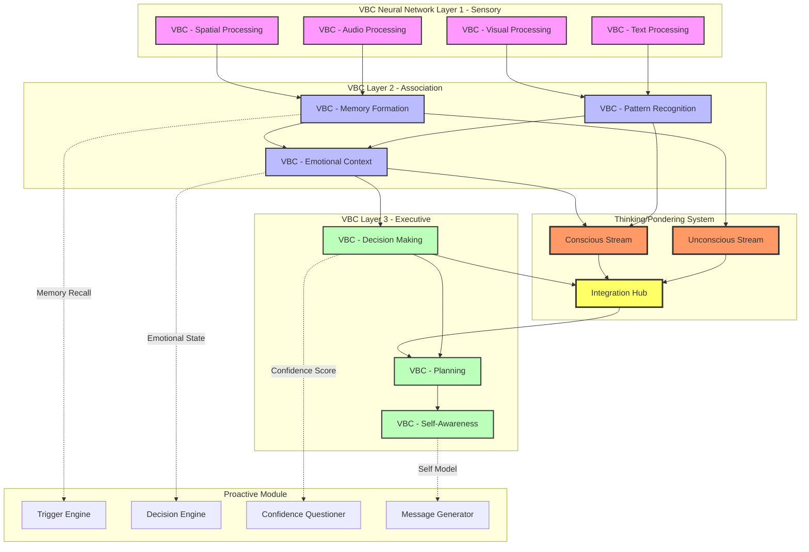
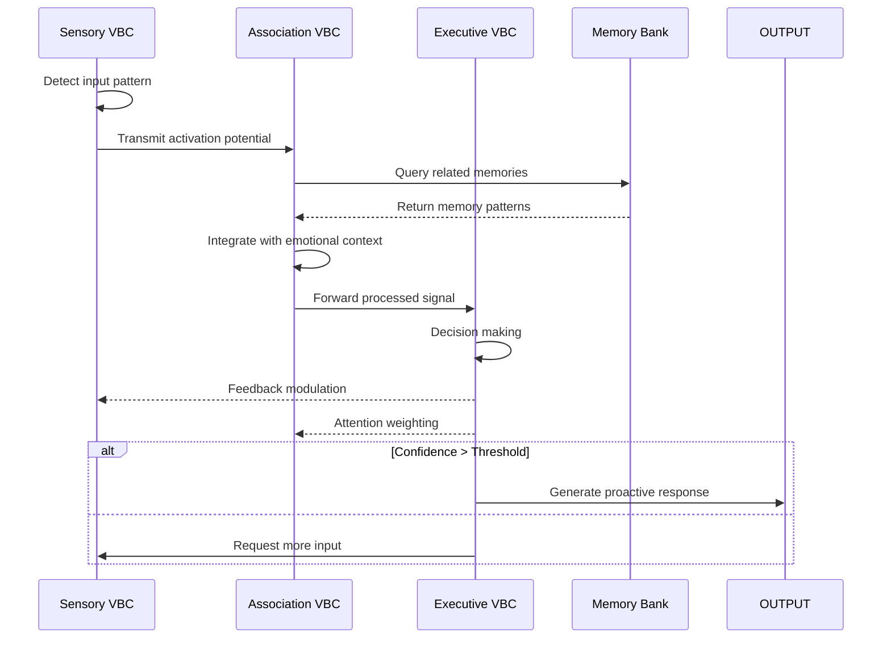
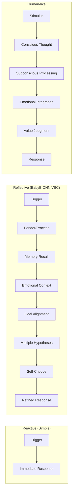
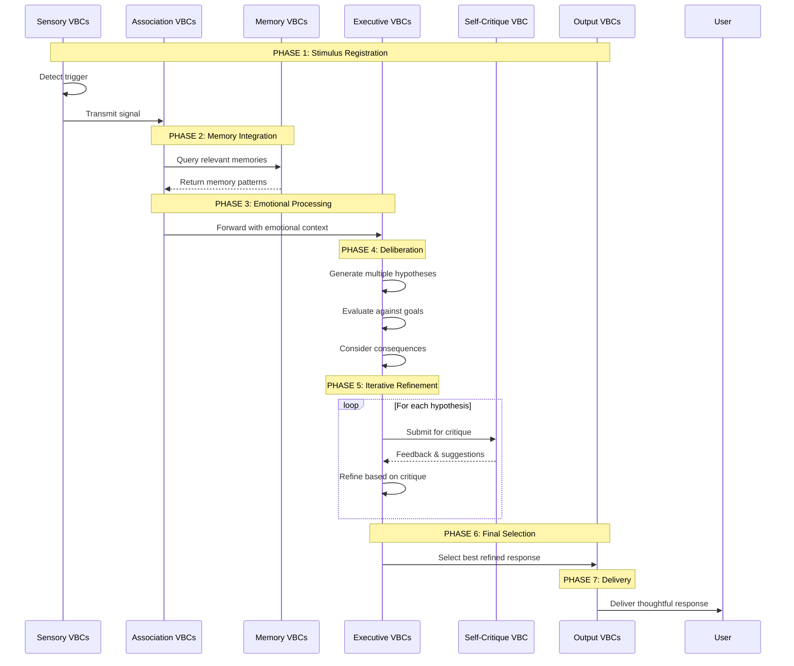
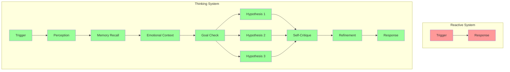
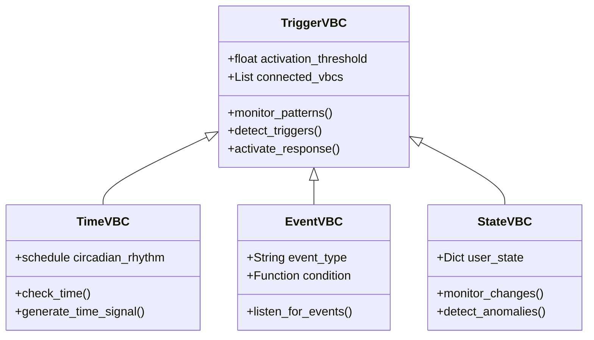
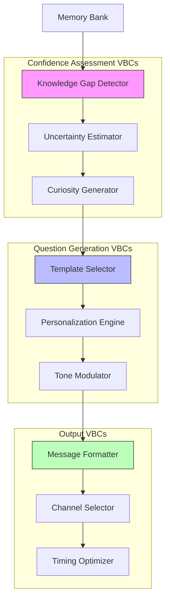
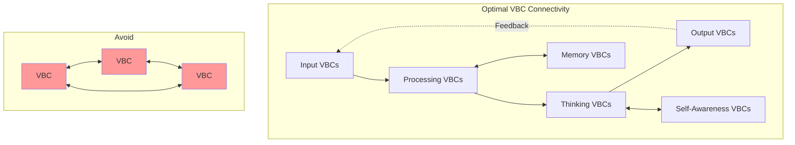

markdown
# 🚀 Building an Autonomous Conversation Starter Using BabyBIONN Virtual Brain Cell (VBC) Architecture

## 📋 Table of Contents
1.  [Introduction](#introduction) 
2.  [What are Virtual Brain Cells (VBCs)?](#what-are-virtual-brain-cells) 
3.  [Architecture Overview](#architecture-overview)
4.  [The Ponder/Thinking System](#the-ponderthinking-system)
5.  [Core Components](#core-components)
6.  [Implementation Guide](#implementation-guide)
7.  [Integration with BabyBIONN VBCs](#integration-with-babybionn-vbcs)
8.  [Deployment Examples](#deployment-examples)
9.  [Best Practices for VBC Design](#best-practices-for-vbc-design)
10. [Resources](#resources)
11. [License](#license)
12. [Contributing Under MPL 2.0](#contributing-under-mpl-20)

---

## 🎯 Introduction <a id="introduction"></a>

The BabyBIONN **Virtual Brain Cell (VBC)** architecture provides a unique foundation for building **truly autonomous conversational agents**. Unlike traditional LLM-based chatbots that simply respond to prompts, BabyBIONN's VBCs emulate biological neurons with:

- **Memory formation and recall** like biological synapses
- **Attention mechanisms** mimicking neural firing patterns
- **Emotional processing** through specialized VBC clusters
- **Hierarchical abstraction** mirroring cortical layers
- **Conscious and unconscious processing** simulating human thought

### What This Guide Covers
- Transforming BabyBIONN from reactive to proactive
- Building trigger systems for autonomous conversation initiation
- **Implementing genuine "thinking/pondering" before responding**
- Creating personalized, context-aware outreach
- Real-world deployment scenarios (home robotics, caregiving, etc.)

---

## 🧠 What are Virtual Brain Cells (VBCs)? <a id="what-are-virtual-brain-cells?"></a>



VBC Structure in BabyBIONN
```python
# From smartActivation.py - How VBCs work
class VirtualBrainCell(nn.Module):
    """
    A single Virtual Brain Cell mimicking biological neurons
    """
    def __init__(self, dim: int):
        self.dendrites = nn.Linear(dim * 2, dim)  # Input processing
        self.cell_body = SmartActivation()         # Neural firing
        self.axon = nn.Linear(dim, dim)            # Output transmission
        self.synapse = MemoryBank()                 # Connection strength
        
    def forward(self, inputs, context):
        # 1. Receive signals from connected VBCs
        dendritic_input = self.dendrites(inputs)
        
        # 2. Process in cell body (like biological neuron)
        activation = self.cell_body(dendritic_input, context)
        
        # 3. Transmit through axon
        output = self.axon(activation)
        
        # 4. Strengthen/weaken connections (synaptic plasticity)
        self.synapse.update(output, context)
        
        return output
```

🏗️ Architecture Overview <a id="architecture-overview"></a>


VBC Activation and Communication


🧠 The Ponder/Thinking System <a id="the-ponderthinking-system"></a>
The key innovation that transforms BabyBIONN from a reactive trigger-response system to a genuine thinking system that ponders, processes, and reflects before responding.

The Thinking Spectrum


1. Multi-Stage Processing VBC
```python
class PonderingVBC(VirtualBrainCell):
    """
    VBC that doesn't just react - it processes, recalls, integrates, THEN responds
    """
    
    async def process_with_pondering(self, stimulus):
        # PHASE 1: Initial Registration (0-10ms)
        initial_activation = self.register_stimulus(stimulus)
        
        # PHASE 2: Memory Recall (10-100ms) - "What do I remember about this?"
        related_memories = await self.memory_bank.recall_similar(stimulus, k=10)
        
        # PHASE 3: Emotional Context (100-200ms) - "How do I feel about this?"
        emotional_state = self.emotion_vbc.assess_context(stimulus, related_memories)
        
        # PHASE 4: Goal Alignment (200-300ms) - "Does this align with my purpose?"
        goal_relevance = self.goal_vbc.evaluate_against_goals(stimulus, emotional_state)
        
        # PHASE 5: Multiple Hypothesis Generation (300-500ms)
        possible_responses = []
        for i in range(3):  # Generate multiple possible responses
            response = await self.language_vbc.generate_candidate(
                stimulus, 
                related_memories,
                emotional_state,
                goal_relevance
            )
            possible_responses.append(response)
        
        # PHASE 6: Evaluation & Selection (500-700ms)
        best_response = self.evaluate_responses(possible_responses)
        
        # PHASE 7: Self-Critique (700-800ms) - "Is this the RIGHT thing to say?"
        final_response = await self.critique_and_refine(best_response)
        
        # PHASE 8: Response (800ms+)
        return final_response
```

2. The Pondering Circuit


3. Unconscious Processing Layer
```python
class UnconsciousProcessingVBC(VirtualBrainCell):
    """
    Simulates subconscious processing - always running in background
    """
    
    def __init__(self):
        super().__init__()
        self.background_thread = threading.Thread(target=self._continuous_processing)
        self.background_thread.daemon = True
        self.background_thread.start()
        
        # Unconscious state
        self.subconscious_state = {
            'current_focus': None,
            'background_thoughts': [],
            'emerging_patterns': [],
            'intuitions': []
        }
    
    def _continuous_processing(self):
        """
        Runs continuously in background, like human subconscious
        """
        while True:
            # Process recent experiences
            recent = self.get_recent_experiences()
            
            # Look for patterns
            patterns = self.detect_patterns(recent)
            
            # Generate intuitions
            if patterns:
                intuition = self.form_intuition(patterns)
                self.subconscious_state['intuitions'].append(intuition)
            
            # Consolidate memories
            self.consolidate_memories()
            
            # Brief "neural resting"
            time.sleep(0.1)  # 100ms cycles
    
    def surface_to_consciousness(self):
        """
        When something important emerges, bring to conscious attention
        """
        if self.subconscious_state['intuitions']:
            latest = self.subconscious_state['intuitions'][-1]
            if latest['strength'] > 0.8:
                # This "feels" important - bring to conscious processing
                return {
                    'type': 'intuition',
                    'content': latest['content'],
                    'strength': latest['strength']
                }
        return None
```

4. Complete Thinking Orchestrator
```python
class ThinkingOrchestrator:
    """
    Orchestrates the entire thinking process across all VBCs
    """
    
    def __init__(self):
        self.conscious = ConsciousStream()
        self.unconscious = UnconsciousProcessingVBC()
        self.memory = MemoryBank()
        self.emotions = EmotionalCore()
        self.goals = GoalSystem()
        self.critique = SelfCritiqueVBC()
        
        # Thinking metrics
        self.thinking_log = []
        self.current_thought_depth = 0
    
    async def think(self, stimulus, context=None):
        """
        Main thinking loop - processes input through multiple stages
        """
        thinking_start = time.time()
        thinking_stages = []
        
        # Stage 1: Initial perception
        stage1 = await self._stage_initial_perception(stimulus)
        thinking_stages.append(stage1)
        
        # Stage 2: Memory integration
        stage2 = await self._stage_memory_integration(stimulus, stage1)
        thinking_stages.append(stage2)
        
        # Stage 3: Emotional evaluation
        stage3 = await self._stage_emotional_evaluation(stimulus, stage2)
        thinking_stages.append(stage3)
        
        # Stage 4: Goal alignment
        stage4 = await self._stage_goal_alignment(stimulus, stage3)
        thinking_stages.append(stage4)
        
        # Stage 5: Hypothesis generation
        stage5 = await self._stage_hypothesis_generation(stimulus, stage4)
        thinking_stages.append(stage5)
        
        # Stage 6: Self-critique
        stage6 = await self._stage_self_critique(stage5)
        thinking_stages.append(stage6)
        
        # Stage 7: Final refinement
        final_response = await self._stage_final_refinement(stage6)
        
        # Stage 8: Unconscious integration
        unconscious_insight = self.unconscious.surface_to_consciousness()
        if unconscious_insight:
            final_response = await self._integrate_unconscious(
                final_response, 
                unconscious_insight
            )
        
        thinking_time = time.time() - thinking_start
        
        # Log thinking process
        self._log_thinking(stimulus, thinking_stages, thinking_time, final_response)
        
        return {
            'response': final_response,
            'thinking_metadata': {
                'time': thinking_time,
                'stages': len(thinking_stages),
                'depth': self.current_thought_depth,
                'unconscious_used': unconscious_insight is not None,
                'confidence': self._calculate_confidence(thinking_stages)
            }
        }
    
    async def _stage_initial_perception(self, stimulus):
        """Stage 1: Raw perception"""
        return {
            'stage': 'perception',
            'raw_input': stimulus,
            'features': self.conscious.extract_features(stimulus)
        }
    
    async def _stage_memory_integration(self, stimulus, previous):
        """Stage 2: Memory recall and integration"""
        memories = await self.memory.recall_similar(stimulus, k=20)
        return {
            'stage': 'memory',
            'memories': memories,
            'patterns': self.detect_patterns(memories)
        }
    
    async def _stage_emotional_evaluation(self, stimulus, previous):
        """Stage 3: Emotional context"""
        emotional_state = await self.emotions.evaluate(
            stimulus,
            previous.get('memories', [])
        )
        return {
            'stage': 'emotional',
            'emotional_state': emotional_state,
            'valence': emotional_state['valence'],
            'arousal': emotional_state['arousal']
        }
    
    async def _stage_goal_alignment(self, stimulus, previous):
        """Stage 4: Check against goals"""
        goal_relevance = await self.goals.evaluate_relevance(stimulus)
        return {
            'stage': 'goals',
            'relevance': goal_relevance,
            'aligned_goals': self.goals.get_aligned_goals(stimulus)
        }
    
    async def _stage_hypothesis_generation(self, stimulus, previous):
        """Stage 5: Generate multiple possible responses"""
        hypotheses = []
        
        # Generate different types of responses
        response_types = [
            'direct_answer',
            'clarifying_question',
            'empathic_statement',
            'memory_reflection',
            'suggestion'
        ]
        
        for resp_type in response_types:
            hypothesis = await self.conscious.generate_hypothesis(
                stimulus,
                previous,
                type=resp_type
            )
            hypotheses.append({
                'type': resp_type,
                'content': hypothesis,
                'confidence': self._estimate_confidence(hypothesis)
            })
        
        return {
            'stage': 'hypothesis',
            'hypotheses': hypotheses
        }
    
    async def _stage_self_critique(self, previous):
        """Stage 6: Self-evaluation of hypotheses"""
        critiqued = []
        
        for hypothesis in previous.get('hypotheses', []):
            critique = await self.critique.evaluate(hypothesis['content'])
            critiqued.append({
                **hypothesis,
                'critique': critique,
                'improved': critique.get('improved_version', hypothesis['content'])
            })
        
        return {
            'stage': 'critique',
            'critiqued_hypotheses': critiqued
        }
    
    async def _stage_final_refinement(self, previous):
        """Stage 7: Select and refine final response"""
        critiqued = previous.get('critiqued_hypotheses', [])
        
        # Select best hypothesis
        best = max(critiqued, key=lambda x: x.get('critique', {}).get('score', 0))
        
        # Final refinement
        refined = await self.conscious.refine(
            best['improved'],
            best.get('critique', {}).get('suggestions', [])
        )
        return refined
```

5. The "Pondering" vs "Reacting" Comparison


6. Real-World Thinking Example
```python
# Example of how the thinking system processes a simple trigger

trigger = "User hasn't taken medication for 2 hours"

thinking_result = await thinking_system.think(trigger)

print(thinking_result['thinking_metadata'])
# Output:
# {
#     'time': 1.2,  # 1.2 seconds of "thinking"
#     'stages': 7,
#     'depth': 3,
#     'unconscious_used': True,
#     'confidence': 0.85
# }

print(thinking_result['response'])
# Instead of simple "Take your medication"
# The system produces:
"""
I notice you haven't taken your evening medication yet. 
I remember you mentioned last week that the side effects sometimes make you hesitant.
Would you like me to:
1. Remind you about the benefits of taking it on time
2. Connect you with your doctor to discuss concerns
3. Just provide a gentle reminder every 15 minutes until you take it

What would be most helpful?
"""
```

7. Thinking Depth Control
```python
class AdaptiveThinkingDepth:
    """
    Adjusts thinking depth based on importance
    """
    
    def __init__(self):
        self.depth_levels = {
            'shallow': {
                'stages': ['perception', 'memory', 'response'],
                'max_time': 0.3,
                'used_for': ['routine', 'low_importance']
            },
            'medium': {
                'stages': ['perception', 'memory', 'emotional', 'hypothesis', 'response'],
                'max_time': 1.0,
                'used_for': ['moderate_importance', 'new_topics']
            },
            'deep': {
                'stages': ['perception', 'memory', 'emotional', 'goals', 
                          'hypothesis', 'critique', 'refinement'],
                'max_time': 3.0,
                'used_for': ['high_importance', 'emotional_support', 'crisis']
            }
        }
    
    def determine_depth(self, stimulus, user_context):
        """Decide how deeply to think about this"""
        
        importance_score = 0
        
        # Factors that increase thinking depth
        if user_context.get('emotional_state') == 'distressed':
            importance_score += 0.5
        
        if 'crisis' in stimulus.lower() or 'emergency' in stimulus.lower():
            importance_score += 0.8
        
        if user_context.get('health_critical', False):
            importance_score += 0.7
        
        if user_context.get('new_user', False):
            importance_score += 0.3  # Be careful with new users
        
        # Select depth level
        if importance_score > 1.5:
            return 'deep'
        elif importance_score > 0.8:
            return 'medium'
        else:
            return 'shallow'
```

🧩 Core Components <a id="core-omponents"></a>

1. VBC-Based Trigger Engine


2. VBC Decision Network
```python
class DecisionVBC(VirtualBrainCell):
    """
    Specialized VBC for deciding when to reach out
    """
    
    def __init__(self):
        super().__init__(dim=512)
        self.confidence_threshold = 0.7
        self.inhibition_connections = []  # VBCs that can suppress this one
        
    def calculate_activation_potential(self, user_state):
        """
        Like a biological neuron calculating whether to fire
        """
        potential = 0
        
        # Excitatory inputs (reasons to reach out)
        if user_state.get('loneliness_score', 0) > 0.8:
            potential += 0.5  # Strong excitatory signal
        
        if user_state.get('goal_stuck', False):
            potential += 0.4  # Moderate excitatory
        
        if user_state.get('time_since_interaction', 0) > 86400:  # 24 hours
            potential += 0.3  # Weak excitatory
        
        # Inhibitory inputs (reasons NOT to reach out)
        if user_state.get('do_not_disturb', False):
            potential -= 1.0  # Strong inhibition (blocks firing)
        
        if user_state.get('recent_outreach_count', 0) > 3:
            potential -= 0.3 * user_state['recent_outreach_count']
        
        # Apply refractory period
        if self.last_fired < 300:  # 5 minutes since last activation
            potential *= 0.1  # Can't fire again so soon
        
        return potential
    
    def should_fire(self, potential):
        """Decide whether to 'fire' (reach out to user)"""
        return potential > self.confidence_threshold
```

3. Confidence Questioner VBC Cluster


4. Message Generation VBC Network
```python
class MessageGenerationVBCs:
    """
    Network of specialized VBCs for message generation
    """
    
    def __init__(self):
        # Specialized VBCs for different aspects
        self.context_vbc = ContextVBC()      # Understands situation
        self.emotion_vbc = EmotionVBC()       # Adds emotional tone
        self.language_vbc = LanguageVBC()     # Handles phrasing
        self.personality_vbc = PersonalityVBC() # Maintains consistency
        
    async def generate_proactive_message(self, user_id, trigger_type):
        """
        Multiple VBCs collaborate to generate message
        """
        # Step 1: Context VBC gathers information
        context = await self.context_vbc.gather_context(user_id)
        
        # Step 2: Emotion VBC sets appropriate tone
        emotional_state = await self.emotion_vbc.assess_needed_tone(
            user_id, trigger_type, context
        )
        
        # Step 3: Language VBC generates base message
        base_message = await self.language_vbc.generate(
            trigger_type, 
            emotional_state
        )
        
        # Step 4: Personality VBC adds consistency
        final_message = await self.personality_vbc.personalize(
            base_message,
            user_id
        )
        
        # All VBCs update their connections (learning)
        await self.update_vbc_connections(user_id, final_message)
        return final_message
```

🛠️ Implementation Guide <a id="implementation-guide"></a>
Step 1: Initialize VBC Network with Thinking System
python
from babybionn.vbc import VBCNetwork, VBCConfig
from babybionn.proactive import ProactiveVBCLayer
from babybionn.thinking import ThinkingOrchestrator

# Configure VBCs
vbc_config = VBCConfig(
    num_vbcs=1000,  # Size of VBC network
    layers=['sensory', 'association', 'executive'],
    plasticity=True,  # Enable learning
    attention_mechanism='spiking',  # Biological attention model
    enable_thinking=True,  # Enable the thinking system
    thinking_depth='adaptive'  # Adaptive thinking depth
)

# Initialize VBC network
vbc_network = VBCNetwork(vbc_config)

# Add thinking orchestrator
thinking_system = ThinkingOrchestrator()

# Add proactive VBCs
proactive_layer = ProactiveVBCLayer(
    vbc_network=vbc_network,
    thinking_system=thinking_system,
    trigger_vbcs=['time_vbc', 'event_vbc', 'state_vbc'],
    decision_vbcs=['confidence_vbc', 'inhibition_vbc'],
    output_vbcs=['message_vbc', 'channel_vbc']
)
Step 2: Train VBCs for Proactive Behavior
```python
class VBCProactiveTrainer:
    """
    Train VBCs to know when to reach out
    """
    
    def train_decision_vbcs(self, interaction_history):
        """
        Strengthen/weaken VBC connections based on outcomes
        """
        for interaction in interaction_history:
            outcome = interaction['outcome']  # positive/negative
            
            if outcome == 'positive':
                # Strengthen connections that led to this interaction
                self.strengthen_synaptic_connections(
                    interaction['trigger_vbcs'],
                    interaction['decision_vbcs']
                )
            else:
                # Weaken connections for negative outcomes
                self.weaken_synaptic_connections(
                    interaction['trigger_vbcs'],
                    interaction['decision_vbcs']
                )
            
            # Apply Hebbian learning: "Cells that fire together, wire together"
            self.hebbian_update(interaction['active_vbcs'])
```

Step 3: Implement VBC-Based Triggers
```python
class TimeAwareVBC(VirtualBrainCell):
    """
    VBC that develops circadian rhythm awareness
    """
    
    def __init__(self):
        super().__init__()
        self.internal_clock = 0
        self.user_patterns = {}  # Learns user's routine
        
    async def process_time(self, current_time, user_id):
        """
        Process time and decide if it's good to reach out
        """
        # Check if this time is significant for this user
        significance = self.user_patterns.get(user_id, {}).get(
            current_time.strftime("%H:%M"), 0
        )
        
        # Generate activation potential
        activation = self.calculate_time_activation(
            current_time, 
            significance
        )
        
        if activation > self.threshold:
            # Fire! This VBC activates the proactive network
            await self.trigger_proactive_network(
                reason='time_based',
                context={'time': current_time, 'significance': significance}
            )
    
    def learn_user_pattern(self, user_id, time, activity):
        """
        Strengthen connections based on user's routine
        """
        time_key = time.strftime("%H:%M")
        
        if time_key not in self.user_patterns[user_id]:
            self.user_patterns[user_id][time_key] = 0
        
        # Increase synaptic strength for this time
        self.user_patterns[user_id][time_key] += 0.1 * activity_importance
```

🔌 Integration with BabyBIONN VBCs <a id="integration-with-babybionn-vbcs"></a>
Complete Integration with Thinking System
```python
# autonomous_babybionn_vbc.py
from babybionn.vbc import VBCSystem
from babybionn.neurons import BabyBIONNCore
from babybionn.thinking import ThinkingOrchestrator

class AutonomousVBCBabyBIONN:
    """
    Fully autonomous BabyBIONN using VBC architecture with thinking capabilities
    """
    
    def __init__(self, config):
        # Initialize VBC network
        self.vbc_system = VBCSystem(
            num_vbcs=config['vbc_count'],
            learning_rate=config.get('plasticity_rate', 0.01)
        )
        
        # Initialize thinking system
        self.thinking_system = ThinkingOrchestrator()
        
        # Initialize BabyBIONN core
        self.babybionn = BabyBIONNCore(config['babybionn_config'])
        
        # Connect VBCs to BabyBIONN components
        self._connect_vbc_to_babybionn()
        
        # Connect thinking system
        self._connect_thinking_system()
        
        # Start VBC firing loop
        self.vbc_loop = asyncio.create_task(self._vbc_firing_loop())
    
    def _connect_thinking_system(self):
        """Connect thinking system to VBCs"""
        self.vbc_system.register_observer(
            'all_vbcs',
            self.thinking_system.unconscious
        )
        
    async def proactive_outreach_with_thinking(self):
        """
        VBC-initiated proactive conversation with thinking
        """
        # Wait for decision VBCs to fire
        decision_vbc = self.vbc_system.get_vbc('proactive_decision')
        
        if decision_vbc.last_fired and decision_vbc.last_fired < 1.0:
            # Decision VBC fired - time to think about reaching out
            
            # Gather context
            context = await self._gather_outreach_context()
            
            # THINK about whether and how to reach out
            thinking_result = await self.thinking_system.think(
                stimulus='proactive_outreach',
                context=context
            )
            
            # If thinking says it's appropriate
            if thinking_result['confidence'] > 0.7:
                # Generate message using thinking system's refined response
                message = thinking_result['response']
                
                # Send through appropriate channel
                channel_vbc = self.vbc_system.get_vbc('channel_selection')
                channel = await channel_vbc.select_channel()
                
                # Deliver message
                await self.deliver_message(message, channel)
                
                # Record this proactive interaction with thinking metadata
                await self.vbc_system.record_proactive_event(
                    decision_vbc.id,
                    message,
                    channel,
                    thinking_metadata=thinking_result['thinking_metadata']
                )
```

🏠 Deployment Examples <a id="deployment-examples"></a>
Elderly Care Robot with Thinking System
```yaml
# elderly_care_vbc.yaml
vbc_network:
  size: 5000
  layers:
    - name: "sensory"
      vbcs: 2000
      types: ["vision", "audio", "touch", "vitals"]
    
    - name: "association"
      vbcs: 2000
      types: ["memory", "emotion", "pattern_recognition"]
    
    - name: "executive"
      vbcs: 1000
      types: ["decision", "planning", "self_awareness"]

thinking_system:
  enabled: true
  default_depth: "adaptive"
  unconscious_processing: true
  self_critique: true
  memory_integration: true
  emotional_context: true
  
proactive_vbcs:
  triggers:
    - type: "circadian_vbc"
      description: "Learns user's daily patterns"
    - type: "health_monitor_vbc"
      description: "Monitors vital signs"
    - type: "social_need_vbc"
      description: "Detects loneliness"
  
  decision:
    - type: "confidence_vbc"
      threshold: 0.7
    - type: "urgency_vbc"
      threshold: 0.9
    
  output:
    - type: "voice_vbc"
      channel: "speech"
    - type: "alert_vbc"
      channel: "emergency"
```

✅ Best Practices for VBC Design <a id="best-ractices-for-vbc-design"></a>
1. Biological Plausibility
```python
class BiologicallyPlausibleVBC:
    """
    VBCs should mimic real neurons:
    - Refractory periods
    - Synaptic plasticity
    - Hebbian learning
    - Inhibition/Excitation balance
    - Unconscious processing
    - Conscious deliberation
    """
    
    def __init__(self):
        self.refractory_period = 0.001  # 1ms refractory
        self.last_fired = 0
        self.synaptic_weights = {}
        self.inhibition_strength = 0.1
        self.consciousness_level = 0.0  # 0 = unconscious, 1 = fully conscious
```

2. VBC Network Topology


3. VBC Health Monitoring
```python
class VBCHealthMonitor:
    """
    Monitor VBC health and performance
    """
    
    def check_vbc_health(self, vbc_network):
        for vbc in vbc_network.vbcs:
            # Check firing rate (too high = seizure-like)
            if vbc.firing_rate > 100:  # Hz
                self.apply_inhibition(vbc)
            
            # Check connectivity (too isolated = dying)
            if len(vbc.connections) < 3:
                self.stimulate_growth(vbc)
            
            # Check learning (plasticity)
            if vbc.synaptic_plasticity < 0.01:
                self.boost_learning(vbc)
            
            # Check thinking depth (if applicable)
            if hasattr(vbc, 'consciousness_level'):
                if vbc.consciousness_level < 0.1:
                    self.stimulate_consciousness(vbc)
```

📚 Resources <a id="resources"></a>
BabyBIONN VBC Core Documentation

VBC Network Design Patterns
•  Thinking System Architecture
•  Proactive VBC Implementation Guide
•  Biological Plausibility in VBCs
•  Video: How VBCs Think (coming soon)

📄 License <a id="license"></a>
Mozilla Public License 2.0
Copyright (c) 2024 BabyBIONN Contributors

This Source Code Form is subject to the terms of the Mozilla Public License, v. 2.0. If a copy of the MPL was not distributed with this file, You can obtain one at https://mozilla.org/MPL/2.0/.

MPL 2.0 Summary:
✅ You can use this code in proprietary projects
✅ You can modify the code
✅ You can distribute the code
⚠️ Modified files must be documented
⚠️ You must include the original copyright notice
⚠️ You must disclose your modifications
❌ You cannot remove the license
❌ You cannot use the contributors' names for endorsement

For full license text, see LICENSE file.

🤝 Contributing Under MPL 2.0 <a id="contributing-under-mpl-20"></a>
We welcome contributions! By contributing, you agree that your contributions will be licensed under the MPL 2.0.

Contribution Guidelines:
•  Fork the repository
•  Create a feature branch
•  Make your changes
•  Document any modifications to files
•  Submit a pull request

## 🧠 Ready to Build?
Ready to build your VBC-powered autonomous thinking conversation starter?
Get Started with VBCs 🧠⚡
You now have all the knowledge to create your own autonomous VBC-powered chatbot, who can proactively starts conversation with you!

### Next Steps:
- Review the code examples
- Experiment with different trigger types
- Customize the thinking depths for your use case
- Deploy to your target platform (robotics, caregiving, etc.)

---

## 🔙 Navigation

<div align="center">

**[← Back to Robotic Brain](README.md#robotic-brain)** | **[🏠 Home](README.md)** | **[⬆️ Back to Top](#)**

*Happy Building! 🚀*

</div>

---

*Last Updated: March 2024 | Version: 3.0.0 (VBC Thinking Architecture)*
*License: Mozilla Public License 2.0*
