markdown
# 🧠 BabyBIONN VBC Developer Edition – Virtual Brain Cell Core

[](https://opensource.org/licenses/MPL-2.0)
[](https://deyvitt.github.io/babybionn-vbc-developer/)
[](https://deyvitt.github.io/babybionn-vbc-developer/)
Copyright (c) 2026, BabyBIONN Contributors

---

## 🤔 What is BabyBIONN? (For Absolute Beginners)

**Imagine this:** You have a brilliant friend (an LLM) who is incredibly well-read but has **amnesia**—they forget everything you told them 5 minutes ago and have no personal opinions. They just repeat facts.

**BabyBIONN is the "brain" your friend is missing.** It provides:

| Capability | What It Means |
|------------|---------------|
| **Memory** | Remembers past conversations and preferences |
| **Context** | Understands the full picture, not just the last message |
| **Reasoning** | Forms its own opinions by consulting "experts" (VNIs) |
| **Continuity** | Has a consistent personality across sessions |

**Think of it like this:**
```
Traditional LLM = A genius with amnesia (great mouth, no brain)
BabyBIONN VBC = The missing brain + memory + personality
BabyBIONN + LLM = A complete, trustworthy intelligence
```

---

## 🏗️ What Can You Build With BabyBIONN?

| What You Want | How BabyBIONN Helps | Example VNIs You'd Create |
|---------------|---------------------|--------------------------|
| **Medical AI assistant** | Consult multiple medical experts, check drug interactions, review patient history | `SymptomAnalyzerVNI`, `DrugInteractionVNI`, `PatientHistoryVNI` |
| **Legal document analyzer** | Analyze contracts, check regulations, compare case law | `ContractVNI`, `RegulationVNI`, `CaseLawVNI` |
| **Personal AI with memory** | Remember user preferences, past conversations, learn communication style | `UserProfileVNI`, `ConversationMemoryVNI`, `StyleLearnerVNI` |
| **Autonomous agent** | Make decisions, plan actions, only use LLM for articulation | `DecisionMakerVNI`, `TaskPlannerVNI`, `ActionExecutorVNI` |
| **Multi-modal system** | Process images, audio, video alongside text | `ImageAnalyzerVNI`, `SpeechToTextVNI`, `VideoProcessorVNI` |
| **Decentralized AI network** | Collaborate with other VBCs worldwide | `PeerDiscoveryVNI`, `ConsensusVNI`, `ReputationVNI` |

---

### 💡 Real-World Example: Medical Diagnosis App

Here's how BabyBIONN processes a user query: *"I have a rash and fever"*

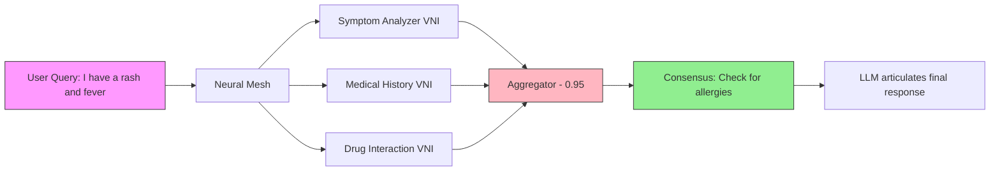

**Without BabyBIONN:** LLM guesses based on internet training (may hallucinate)  
**With BabyBIONN:** Multiple specialized experts collaborate, check facts, and reach consensus

---

## 🔄 How BabyBIONN Compares to Traditional Architectures

| Architecture | How It "Reasons" | Strengths | Weaknesses |
|--------------|-------------------|-----------|------------|
| **Transformer (GPT, BERT)** | Predicts next word based on patterns in training data | Fluency, broad knowledge | No memory, no reasoning, hallucinates |
| **Diffusion (Stable Diffusion)** | Gradually denoises random pixels to match text | Creative image generation | No understanding, just pattern matching |
| **VAE (Variational Autoencoder)** | Compresses data to latent space, reconstructs | Data generation, compression | No reasoning capability |
| **U-Net** | Skip connections for precise localization | Great for segmentation | Single-purpose, no generalization |
| **CNN (Convolutional Neural Net)** | Hierarchical feature detection | Excellent for images | Fixed architecture, no memory |
| **BabyBIONN VBC** | **Multiple specialized VNIs collaborate, debate, and reach consensus** | Memory, reasoning, transparency, continuous learning | Requires integration with LLM for articulation |

---

## 🚀 The BabyBIONN Revolution: Distributed AI Operating System

**BabyBIONN is not just another AI framework. It's the world's first distributed operating system for intelligence.**

### Traditional AI = Monolithic Mainframes
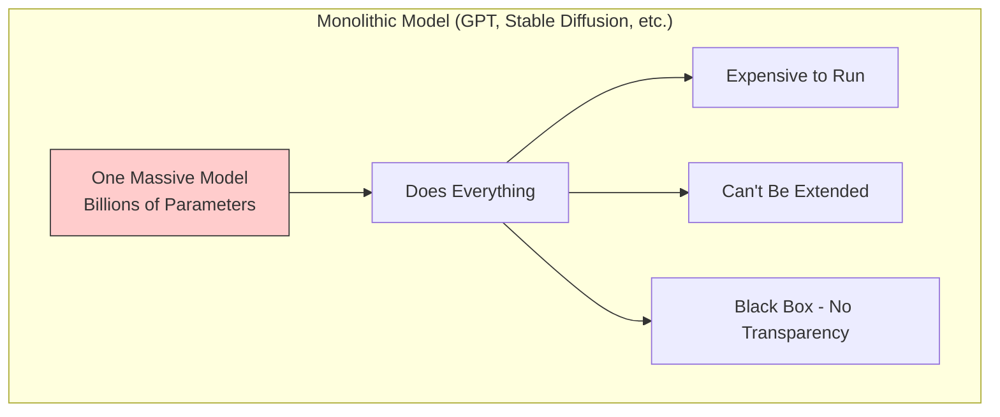

### BabyBIONN = Distributed Microservices for AI
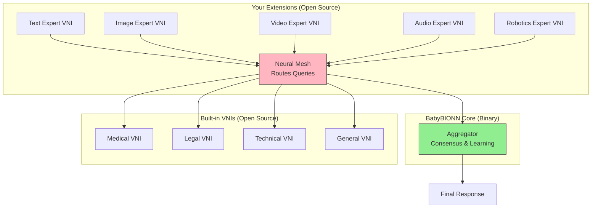

### Why This Changes Everything

| Aspect | Traditional AI | BabyBIONN |
|--------|---------------|-----------|
| **Architecture** | One model does everything | Many specialized experts collaborate |
| **Cost** | $0.02-0.10 per query (runs entire model) | $0.001-0.005 per query (only activate needed experts) |
| **Extensibility** | Retrain entire model (months, $1M+) | Add a new VNI (days, free) |
| **Hardware** | Needs expensive GPUs (A100/H100) | Mix of CPU/GPU/edge devices |
| **Learning** | Isolated to one model | Network-wide Hebbian learning |
| **Transparency** | Black box - can't see inside | Clear chain of expert opinions |

---

## 🧠 How BabyBIONN "Reasons" – Step by Step

Let's trace how BabyBIONN answers: *"Should I take ibuprofen for my headache?"*

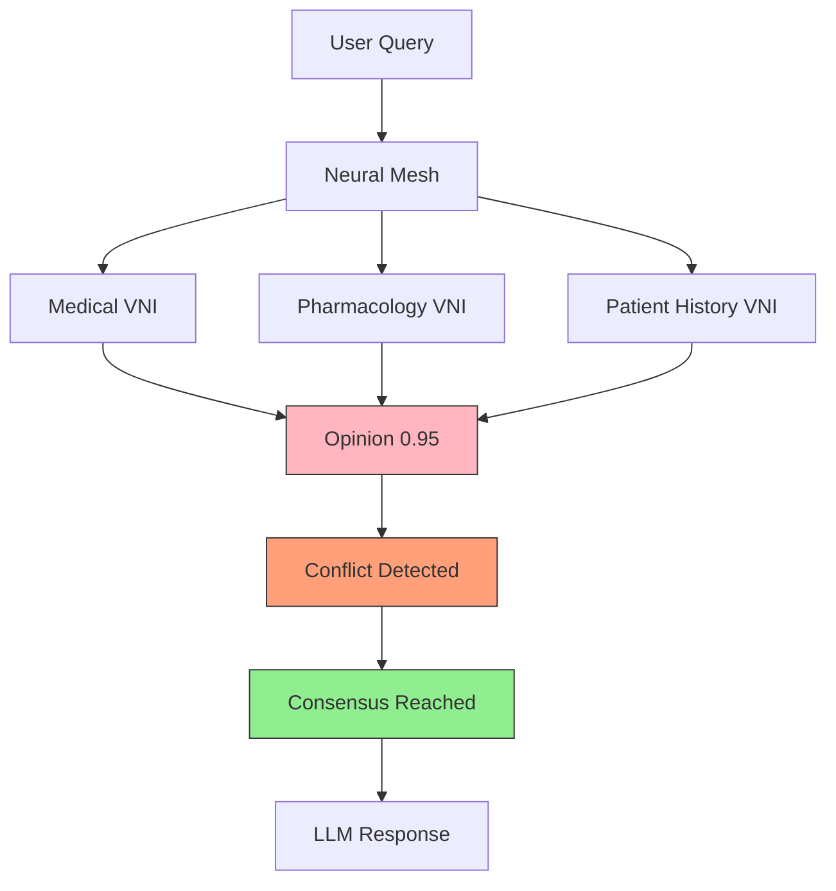

**This is fundamentally different from traditional models:**

| Aspect | Traditional AI | BabyBIONN |
|--------|---------------|-----------|
| **Why this answer?** | "Because the weights said so" (black box) | "Medical VNI said X, Pharmacology VNI said Y, they disagreed, so we..." (transparent) |
| **Can it learn continuously?** | No – needs expensive retraining | Yes – Hebbian learning updates connections in real-time |
| **Does it remember me?** | No – each conversation starts fresh | Yes – persistent memory across sessions |
| **Can it specialize?** | Fine-tuning on specific data | Add a new VNI for any domain |
| **Is it decentralized?** | Centralized servers | P2P network of VBCs |

---

## 🧩 The Extension Ecosystem: Build Anything

BabyBIONN is designed to be infinitely extensible. The core is stable and protected, but **YOU** can build anything around it.

### 🔌 How Extensions Work

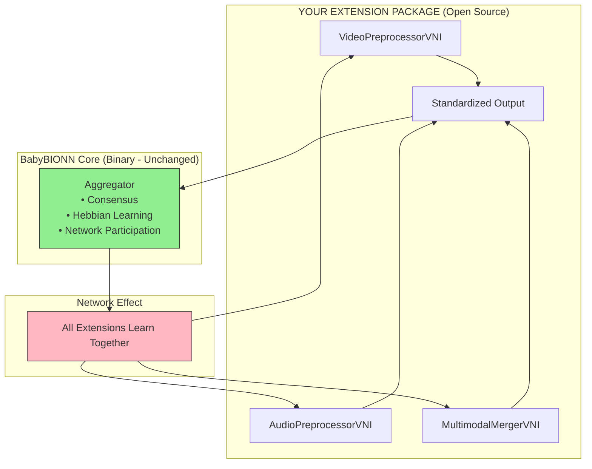

### 🚀 Example: Video Generation Pipeline (DiT + MoE)

```python
from babybionn_video_extension import (
    TextEncoderVNI, MotionExpertVNI, TextureExpertVNI,
    CompositionExpertVNI, VideoDecoderVNI
)

# Distributed video generation - each expert is a separate VBC!
prompt = "a cat playing in a garden at sunset"

# Your pipeline runs across multiple VBCs
text_features = await text_encoder.process(prompt)
motion = await motion_expert.process(text_features)
texture = await texture_expert.process(text_features, motion)
composition = await composition_expert.process(motion, texture)
video = await video_decoder.process(composition)

# BabyBIONN learns which experts work best together!
```

### 🎥 Video Intelligence Platform
```python
from babybionn_video_extension import VideoAnalyzerVNI, SceneDetectorVNI

# Your custom video pipeline
video_vni = VideoAnalyzerVNI()
scene_vni = SceneDetectorVNI()

result = await video_vni.process("security_feed.mp4")
scenes = await scene_vni.process(result)
# BabyBIONN learns which scenes matter!
```

### 🎵 Audio Generation Studio
```python
from babybionn_audio_extension import AudioGeneratorVNI, MusicExpertVNI

# Generate music with specialized experts
melody = await music_vni.generate("happy piano melody")
harmony = await harmony_vni.harmonize(melody)
# BabyBIONN learns what sounds good together!
```

### 🤖 Robotic Brain <a id="robotic-brain"></a>

| Guide | Description |
|-------|-------------|
| [Build Proactive VBC Chatbot](Build_Proactive_VBC_Chatbot.md) | Complete guide to building autonomous conversation starters with thinking/pondering capabilities |
```python
from babybionn_robotics_extension import SensorFusionVNI, MotionPlannerVNI

# Distributed robot control
sensor_data = await fusion_vni.process(camera_data, lidar_data)
motion_plan = await planner_vni.plan_path(sensor_data)
# BabyBIONN learns optimal movement patterns!
```

### 🏥 Medical Imaging Suite
```python
from babybionn_medical_extension import MRIExpertVNI, RadiologyExpertVNI

# Distributed medical diagnosis
mri_analysis = await mri_vni.analyze(patient_scan)
radiology_report = await radiology_vni.interpret(mri_analysis)
# BabyBIONN learns from every diagnosis!
```

---

## 🌐 The Network Effect: Why BabyBIONN Gets Smarter Over Time

Every time ANYONE uses ANY extension, the ENTIRE network learns:

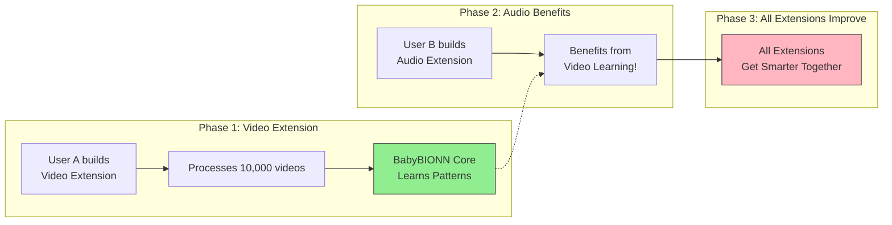

### 📈 The Results

| Metric | Traditional AI | BabyBIONN |
|--------|---------------|-----------|
| **Cost per query** | $0.02-0.10 | $0.001-0.005 |
| **Extensibility** | Retrain entire model (months) | Add new VNI (days) |
| **Learning** | Isolated to one model | Network-wide |
| **Specialization** | One model does all poorly | Many experts collaborate |
| **Hardware** | Needs expensive GPUs | Mix of CPU/GPU/edge |
| **Time to market** | 6-12 months | 1-4 weeks |

---

## 📋 Quick Reference Summary

| Question | Answer |
|----------|--------|
| **What is BabyBIONN?** | The "operating system for intelligence" – provides memory, context, and reasoning to LLMs |
| **What's a VBC?** | Virtual Brain Cell – a single instance of BabyBIONN |
| **What's a VNI?** | Virtual Neuron Instance – a specialized expert module (medical, legal, etc.), which is a 'sub-instance' within a VBC |
| **How is it different?** | Multiple experts collaborate and debate, not just pattern matching |
| **What can I build?** | Medical AI, legal assistants, personal AI with memory, autonomous agents, decentralized AI networks, video/audio generators, robotic brains |
| **Do I need an LLM?** | Yes – VBC is the brain, LLM is the mouth |
| **Is it open source?** | VNIs and tools are open (MPL 2.0); core aggregator is proprietary binary |
| **Can I make money?** | Yes – host VBCs, earn NEUROCENT, build reputation with OxyGEN |

---

## 💡 Creating Your Own Extension

### Step 1: Package Structure
```
babybionn-my-extension/
├── setup.py
├── requirements.txt
├── README.md
├── babybionn_my_extension/
│   ├── __init__.py
│   ├── my_custom_vni.py
│   └── utils.py
└── examples/
    └── demo.py
```

### Step 2: VNI Template
```python
from enhanced_vni_classes.core.base_vni import EnhancedBaseVNI

class MyCustomVNI(EnhancedBaseVNI):
    """My amazing extension that does something incredible"""
    
    async def process(self, input_data, context):
        # Your custom logic here
        result = await self.do_something_amazing(input_data)
        
        # Return in BabyBIONN's standard format
        return {
            "opinion_text": "Description of what happened",
            "confidence_score": 0.95,
            "vni_metadata": {
                "modality": "my_modality",
                "custom_field": "any data",
                "version": "1.0.0"
            }
        }
```

### Step 3: Publish
```bash
# Build and publish to PyPI
python setup.py sdist bdist_wheel
twine upload dist/*

# Share with the community!
```

---

## 🎯 What You CAN vs CANNOT Do

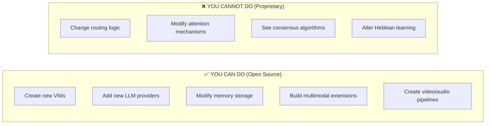

| What You Want To Do | Is It Possible? | How |
|---------------------|-----------------|-----|
| Create a new medical VNI | **✅ YES!** | Copy `medical.py`, modify the `process()` method |
| Build a video generation pipeline | **✅ YES!** | Create a series of VNIs (see Developer Notes) |
| Add a new LLM (Claude, Gemini) | **✅ YES!** | Extend `llm_Gateway.py` |
| Change how queries are routed | **❌ NO** | Routing is in `babybionn-activation` binary |
| Modify attention mechanisms | **❌ NO** | Attention is in `babybionn-attention` binary |
| Join the global P2P network | **🔜 SOON** | Requires binaries for identity signing |
---

**BabyBIONN is not another LLM.** It is the fundamental reasoning layer that gives LLMs context, memory, understanding, and continuity – the **"operating system for intelligence"**.

Each BabyBIONN instance is a single **Virtual Brain Cell (VBC)**. When connected to an LLM (like DeepSeek), it acts as the **brain** while the LLM serves as the **mouth**. Our ultimate vision is to connect millions of VBCs hosted on devices worldwide into a gigantic, decentralized **Virtual Brain** – a global network of contextual reasoners with memory, secured by blockchain‑inspired consensus protocols.

> **This is the Developer Edition** – a clean, open‑source version of the VBC that relies on **five proprietary binary packages** for core functionality. It is designed for developers who want to build, customize, and extend BabyBIONN while keeping the core IP protected.

---

## 📄 BabyBIONN Whitepaper

For a deep dive into the vision, architecture, tokenomics, and technical roadmap of the BabyBIONN decentralized intelligence network, read our official whitepaper:

[](https://deyvitt.github.io/babybionn-vbc-developer/)

**Topics covered:**
- The Layer-0 intelligence architecture
- Virtual Brain Cells (VBCs) and Hebbian learning
- Decentralized P2P network vision
- Three-token economy (OxyGEN, Neuroshare, neurocent)
- ERC-8004 & ERC-8183 integration
- Technical roadmap and ethical considerations

[📖 Read the Full Whitepaper →](https://deyvitt.github.io/babybionn-vbc-developer/)

---

## 👩‍💻 Developer Resources

For detailed guidance on customizing your VBC – including adding multimodal capabilities, GPU support, creating new VNIs, and extending the learning system – check out our **[Developer Notes](DEVELOPERS_NOTES.md)**.

[📘 Read the Developer Notes →](DEVELOPERS_NOTES.md)

---

## 📦 Repository Structure

```
babybionn-vbc-developer/
├── enhanced_vni_classes/        # Open‑source VNIs (medical, legal, technical, general)
├── neuron/
│   ├── p2p/                     # P2P networking layer (libp2p)
│   ├── vni_storage.py           # Storage manager (open source)
│   ├── vni_messenger.py         # Inter‑VNI messaging (open source)
│   └── ...                      # Other open‑source utilities
├── llm_Gateway.py               # LLM client wrapper (open source)
├── template_engine.py           # Template fallback when LLM fails
├── main.py                      # FastAPI application entry point
├── requirements.txt             # Regular Python dependencies
├── requirements-binaries.txt    # Links to 5 private binary packages
├── Dockerfile                   # Docker configuration
└── README.md                    # This file
```

---

## 🧠 Architecture Overview

```
User Query → Neural Mesh (activates VNIs) → Aggregator (binary) → (optional) LLM → Final Response
```

- **VNIs (Virtual Neuron Instances)** – Domain‑expert modules that return an opinion (text) and a confidence score.
- **Neural Mesh** – Routes the query to the most relevant VNIs based on keyword matching and learned patterns.
- **Aggregator (binary)** – Collects VNI outputs, detects conflicts, calculates consensus, and optionally calls an LLM.
- **LLM Gateway** – If enabled and an API key is provided, the aggregator sends a prompt built from the VNIs' reasoning to an LLM and returns the generated text.
- **Memory** – Stores past interactions and learned patterns (supports FAISS for fast similarity search).

---

## 🧠 BabyBIONN Architecture – OPEN VS PROPRIETARY

Here's what you **CAN** modify (open source) vs what you **MUST download** (proprietary binaries):

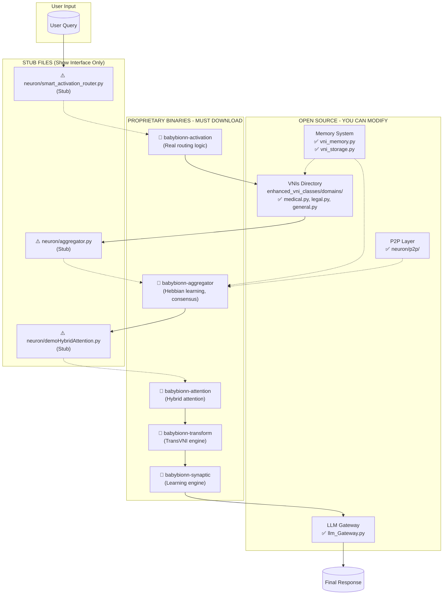

---

## ⚠️ CRITICAL: What's REALLY Open Source vs Stubs

Many files in this repository are **STUBS** – they exist only to show the interface, but the REAL implementation is in the proprietary binaries:

| File | What It Really Is | What You Need |
|------|-------------------|---------------|
| `neuron/smart_activation_router.py` | **⚠️ STUB ONLY** – The actual routing logic is in `babybionn-activation` binary | 🔐 Download package |
| `neuron/demoHybridAttention.py` | **⚠️ STUB ONLY** – Real attention mechanisms in `babybionn-attention` | 🔐 Download package |
| `neuron/aggregator.py` | **⚠️ STUB ONLY** – Real aggregator in `babybionn-aggregator` | 🔐 Download package |
| `enhanced_vni_classes/domains/*.py` | **✅ REAL OPEN SOURCE** – You can modify these! | ✏️ Edit freely |
| `llm_Gateway.py` | **✅ REAL OPEN SOURCE** – You can extend this! | ✏️ Edit freely |
| `neuron/vni_memory.py` | **✅ REAL OPEN SOURCE** – FAISS memory system | ✏️ Edit freely |

---

## 🔐 The 5 Proprietary Binaries

| Package | Description |
|---------|-------------|
| `babybionn-aggregator` | Hebbian learning engine, consensus algorithms, conflict detection, response synthesis |
| `babybionn-synaptic` | Synaptic learning, memory, constants, and core types |
| `babybionn-transform` | TransVNI comparison and segregation |
| `babybionn-activation` | Smart activation routing and `FunctionRegistry` |
| `babybionn-attention` | Hybrid attention mechanisms |

These binaries are **required** for full VBC functionality. Without them, the system will run in a limited offline mode and cannot join the global network.

### 🔑 Obtaining the Binaries

1. Request access to the private repositories by contacting the BabyBIONN team.
2. Once granted, you will be able to clone or install the packages via `pip` using SSH:

```bash
pip install git+ssh://git@github.com/deyvitt/babybionn-aggregator.git
pip install git+ssh://git@github.com/deyvitt/babybionn-synaptic.git
pip install git+ssh://git@github.com/deyvitt/babybionn-transform.git
pip install git+ssh://git@github.com/deyvitt/babybionn-activation.git
pip install git+ssh://git@github.com/deyvitt/babybionn-attention.git
```

⚠️ You must have GitHub SSH keys configured for your account.

---

## ✨ Features of Each VBC

- **Hybrid reasoning pipeline** – VNIs perform deep reasoning; an LLM (DeepSeek/OpenAI) articulates the final response.
- **Multi‑domain VNIs** – Specialized modules for medical, legal, technical, and general queries.
- **Hebbian learning** – Connections between VNIs strengthen or weaken based on co‑activation and outcome quality.
- **Conflict detection & consensus** – The aggregator identifies disagreements and computes consensus levels.
- **Greeting handler** – Simple greetings are caught early for a snappy response.
- **Dockerized** – Easy setup with Docker.
- **Mock mode** – Develop and test without an LLM or actual VNI reasoning.

---

## 📁 Files Beginners Must Know

### 🔴 **TIER 1: START HERE – Your First VNI (✅ OPEN SOURCE)**

| File | Why It's Important |
|------|-------------------|
| `enhanced_vni_classes/core/base_vni.py` | **✅ REAL CODE** – The blueprint for all VNIs. Study this interface. |
| `enhanced_vni_classes/domains/general.py` | **✅ REAL CODE** – The simplest working VNI. Copy this to start. |
| `enhanced_vni_classes/domains/medical.py` | **✅ REAL CODE** – Example of a specialized VNI. |

### 🟠 **TIER 2: Understand How Queries Flow (MIX OF STUBS + OPEN)**

| File | What It Really Is |
|------|-------------------|
| `neuron/smart_activation_router.py` | **⚠️ STUB ONLY** – Shows the interface, but REAL logic is in `babybionn-activation` binary |
| `main.py` | **✅ REAL CODE** – FastAPI entry point. You can modify API endpoints. |
| `llm_Gateway.py` | **✅ REAL CODE** – LLM connector. Extend to add new providers. |

### 🟡 **TIER 3: Memory and Learning (✅ OPEN SOURCE)**

| File | What It Does |
|------|--------------|
| `neuron/vni_memory.py` | **✅ REAL CODE** – FAISS vector memory system. You can modify storage. |
| `neuron/vni_storage.py` | **✅ REAL CODE** – Persistent data storage. |
| `neuron/reinforcement_learning/pretraining_processor.py` | **✅ REAL CODE** – Prepare training data. |

### 🟢 **TIER 4: Future Networking (✅ OPEN SOURCE)**

| File | What It Is |
|------|------------|
| `neuron/p2p/node.py` | **✅ OPEN SOURCE** – P2P node implementation (libp2p) |
| `neuron/p2p/discovery.py` | **✅ OPEN SOURCE** – Peer discovery (mDNS/DHT) |
| `neuron/p2p/messages.py` | **✅ OPEN SOURCE** – Network protocols |

---

## 📦 Prerequisites

- Docker Desktop (for Windows, Mac, or Linux)
- At least 4 GB RAM (8 GB recommended for full LLM integration)
- 2 CPU cores (more for heavy usage)
- ~5 GB free disk space
- (Optional) An API key for DeepSeek or OpenAI
- Git
- GitHub SSH keys configured (for accessing private binary packages)

---

## 🚀 Installation & Setup

### 1. Clone the repository

```bash
git clone https://github.com/deyvitt/babybionn-vbc-developer.git
cd babybionn-vbc-developer
```

### 2. Configure environment variables

```bash
cp .env.example .env
# Edit .env with your preferred settings
```

| Variable | Description | Default |
|----------|-------------|---------|
| `MOCK_MODE` | Use mock responses (bypass real VNIs/LLM) | `false` |
| `LLM_PROVIDER` | LLM to use (`deepseek` or `openai`) | `deepseek` |
| `DEEPSEEK_API_KEY` | Your DeepSeek API key | – |
| `OPENAI_API_KEY` | Your OpenAI API key | – |

### 3. Build and run with Docker

```bash
# Build the image
docker build -t babybionn-vbc-developer .

# Run in mock mode (no binaries needed)
docker run -d -p 8002:8002 -e MOCK_MODE=true --name my-vbc babybionn-vbc-developer

# For full mode with an LLM:
docker run -d -p 8002:8002 -e MOCK_MODE=false -e DEEPSEEK_API_KEY=your-key --name my-vbc babybionn-vbc-developer
```

The application will be available at http://localhost:8002.

---

## 🎮 Usage

- **Chat interface**: http://localhost:8002
- **API documentation**: http://localhost:8002/docs

### API Endpoints

| Method | Endpoint | Description |
|--------|----------|-------------|
| POST | `/api/chat` | Send a message `{"message": "your query", "session_id": "optional"}` |
| GET | `/api/health` | Health check |
| GET | `/api/config/llm-provider` | Get current LLM provider |
| POST | `/api/config/llm-provider` | Update LLM provider `{"provider": "deepseek"}` |

---

## 🛠️ Customizing VNIs

All VNIs are open source and located in `enhanced_vni_classes/domains/`. You can:

- Modify existing VNIs (`medical.py`, `legal.py`, `technical.py`, `general.py`)
- Add new VNIs by following the same pattern
- Adjust routing logic in the open‑source `smart_activation_router.py`

> ⚠️ The aggregator binary automatically detects and uses any VNI that follows the expected interface.

---

## 🎯 What You CAN vs CANNOT Do

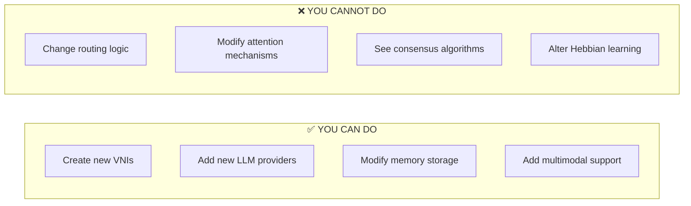

| What You Want To Do | Is It Possible? | How |
|---------------------|-----------------|-----|
| Create a new medical VNI | **✅ YES!** | Copy `medical.py`, modify the `process()` method |
| Change how queries are routed | **❌ NO** | Routing is in `babybionn-activation` binary |
| Add a new LLM (Claude, Gemini) | **✅ YES!** | Extend `llm_Gateway.py` |
| Modify attention mechanisms | **❌ NO** | Attention is in `babybionn-attention` binary |
| Change memory storage | **✅ YES!** | Modify `vni_memory.py` and `vni_storage.py` |
| Add multimodal support | **✅ YES!** | See `DEVELOPERS_NOTES.md` |
| Join the global P2P network | **🔜 SOON** | Requires binaries for identity signing |

---

## 🔍 Quick Troubleshooting

| Problem | Likely Cause | Solution |
|---------|--------------|----------|
| `Module not found: babybionn_activation` | Missing binaries | Install all 5 packages via SSH |
| VNI runs in mock mode but not real mode | Binaries not installed | Download the 5 proprietary packages |
| `Function not implemented` errors | Using stub without binaries | Install binaries or use `MOCK_MODE=true` |
| My VNI isn't being called in real mode | Confidence too low | Increase confidence score in `process()` return |
| Can't import from `neuron.smart_activation` | That's a stub! | The real code is in the binary |

---

## 📚 Recommended Learning Path

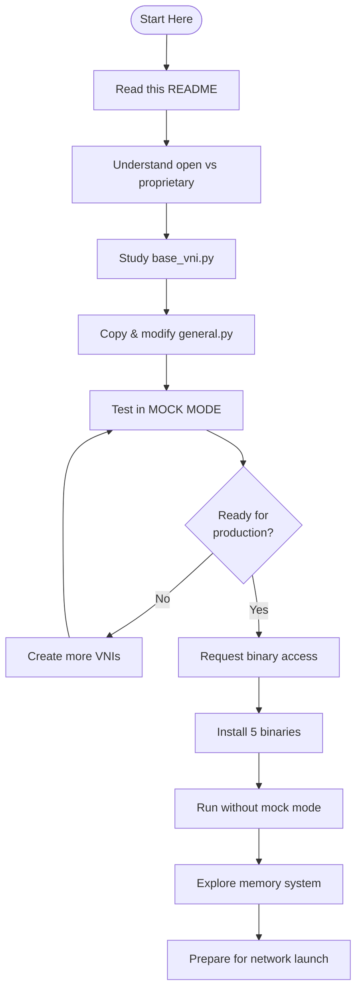

---

## 🌐 Repository Structure Visualization

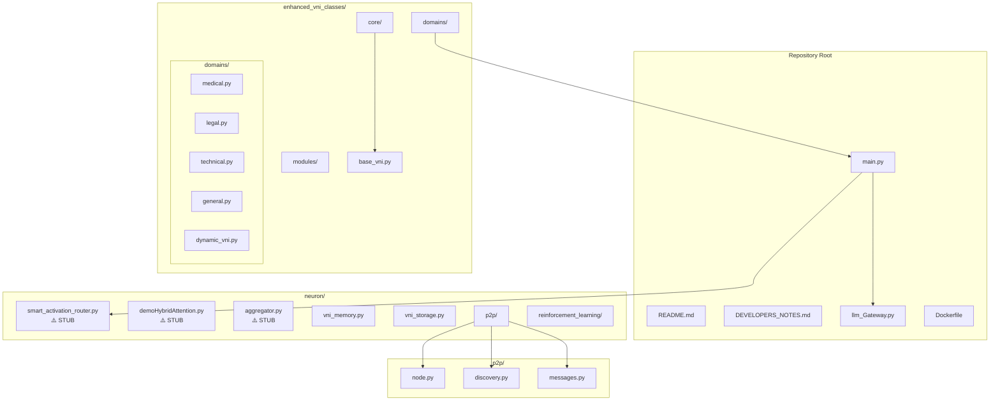

---

## 🌐 Joining the Global Network (Coming Soon)

When the decentralized network launches, you will be able to:

- Complete KYC and acquire $NEUROCENT tokens.
- Configure your VBC to connect to the P2P network.
- Start earning rewards for contributing reasoning, memory, and compute.

Stay tuned for updates!

---

## 📄 License

- **Open‑source components**: MPL 2.0 (VNIs, P2P layer, utilities, LLM gateway)
- **Binary packages**: Proprietary (aggregator, synaptic learning, attention, activation, transform)

For more details, see the LICENSE file.

---

## 🤝 Contributing

Contributions to the open‑source parts are welcome! By submitting a pull request, you agree that your contributions will be licensed under the MPL 2.0. Please ensure your changes do not introduce incompatible dependencies.

---

## 📬 Contact & Community

- **GitHub Issues**: [https://github.com/deyvitt/babybionn-vbc-developer/issues](https://github.com/deyvitt/babybionn-vbc-developer/issues)
- **Website**: https://babybionn.net (coming soon)
- **Discord / Telegram**: (coming soon)

---

> **Remember: The `.py` files in `neuron/` are often STUBS showing the interface. The REAL intelligence is in the 5 binaries you must download.**

Build your VNIs, experiment in mock mode, and when you're ready for production, get the binaries and join the network! 🧠✨

---

This README is tailored for the **developer edition**, highlighting:

- ✅ What BabyBIONN is (simple explanation)
- ✅ What you can build (concrete examples)
- ✅ How it compares to traditional AI
- ✅ Open‑source structure
- ✅ The 5 private binary packages
- ✅ Clear instructions for obtaining and installing binaries
- ✅ Updated Docker and installation steps
- ✅ Customization guidance
- ✅ Future network participation 
